# bRPC FlatBuffers 免反序列化方案（图示版）

> 用途：方案串讲与技术评审。  
> 当前范围：先验证 FlatBuffers over TCP；后续再提取通用 Region，并接入 RDMA/URMA。

## 1. 一句话目标

> 将网络收到的编码字节保存在生命周期受控的数据区域中，经过类型安全校验后，为业务提供可直接读取的类型化视图，减少完整反序列化、对象分配和不必要的内存复制。

第一阶段承诺的是“免反序列化 + 条件式零拷贝快路径”，不是无条件的全链路零拷贝。

## 2. 传统路径与目标路径

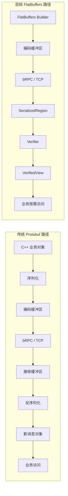

主要变化发生在接收端：

```text
传统：字节 → 解析全部字段 → 构造新对象 → 业务访问
目标：字节 → 安全校验 → 建立只读视图 → 业务按需访问
```

## 3. 整体分层设计

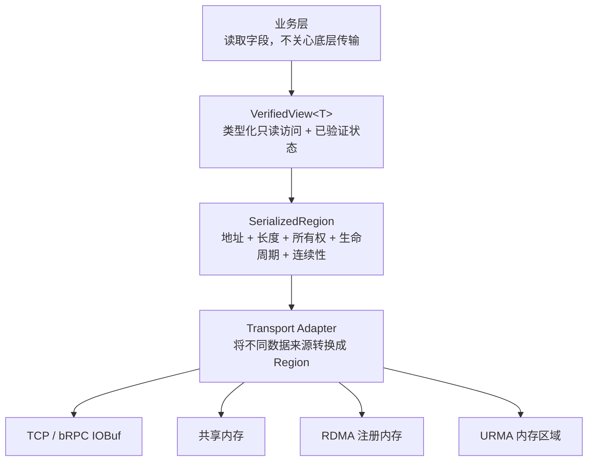

| 层次 | 主要职责 |
|---|---|
| 业务层 | 使用类型化接口读取字段 |
| `VerifiedView<T>` | 格式解释、安全状态和访问入口 |
| `SerializedRegion` | 数据地址、长度、所有权、生命周期和内存属性 |
| Transport Adapter | 接入 IOBuf、共享内存、RDMA、URMA |

设计原则是格式与传输解耦：FlatBuffers 不直接依赖 RDMA，RDMA/URMA Region 也不只服务于 FlatBuffers。

## 4. 普通 C++ 对象与 FlatBuffers 布局

### 4.1 普通 C++ 对象

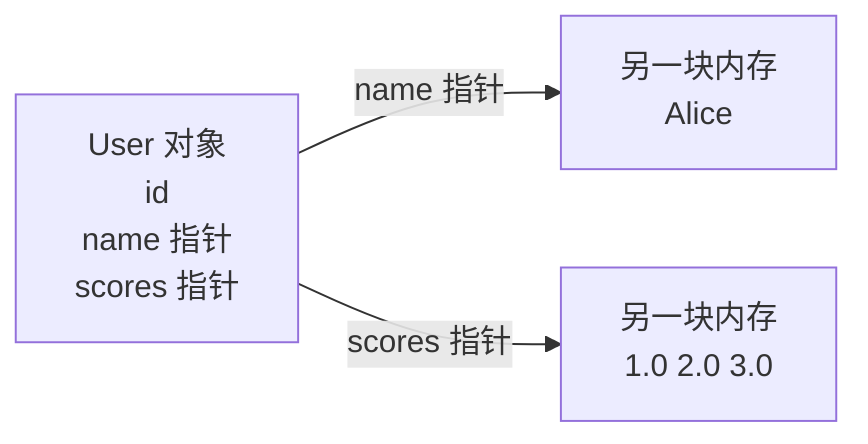

普通 `std::string`、`std::vector` 通常包含进程内指针。发送端的指针值在接收端没有意义，因此不能直接传输普通 C++ 对象内存。

### 4.2 FlatBuffers 编码布局

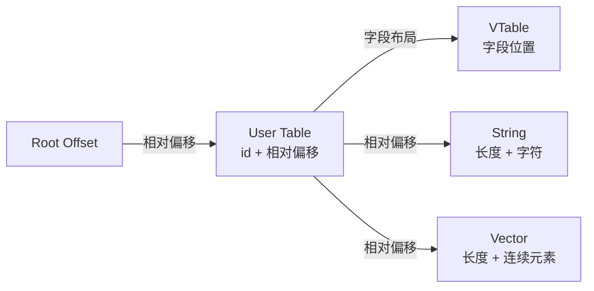

FlatBuffers 使用相对偏移而不是进程指针。因此整块 buffer 移动到另一地址或另一机器后，内部关系仍然可以解释。

## 5. 类型化视图如何构造

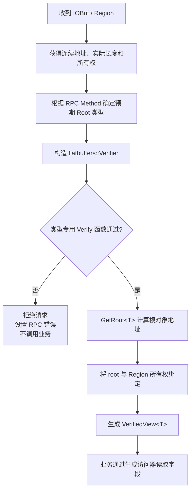

概念代码：

```cpp
auto region = SerializedRegion::FromIOBuf(input);

flatbuffers::Verifier verifier(
    region.data(), region.size());

if (!VerifyRequestBuffer(verifier)) {
    return InvalidRequest();
}

const Request* root =
    flatbuffers::GetRoot<Request>(region.data());

VerifiedView<Request> view(
    std::move(region), root);
```

这里没有构造一套新的 `Request` 对象树。`root` 只是原始 FlatBuffers 数据的类型化入口。

## 6. 安全校验过程

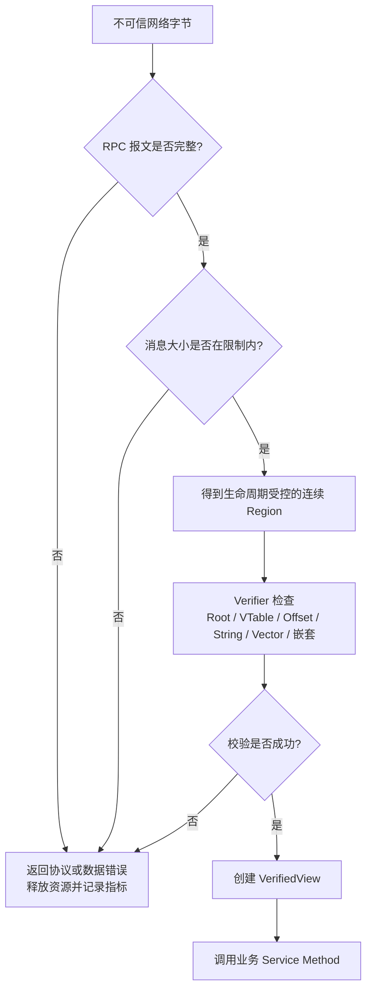

必须校验的原因：FlatBuffers 内部保存大量相对偏移和长度。恶意或损坏数据可能伪造 Root Offset、Vector 长度或 String 边界。直接 `GetRoot<T>()` 并不能证明这些值合法。

安全策略：

- 先检查 RPC 消息边界和最大长度；
- 再获得有效且不会提前释放的 Region；
- 使用当前 Method 对应的类型专用 Verifier；
- 校验失败时不得调用业务方法；
- 校验成功后才允许构造 View；
- 同时限制嵌套深度、对象数量和并发资源占用。

Checksum 不能代替 Verifier：Checksum 检查内容是否符合测试预期，Verifier 检查这些字节是否能被安全解释。

## 7. IOBuf 的连续与分片路径

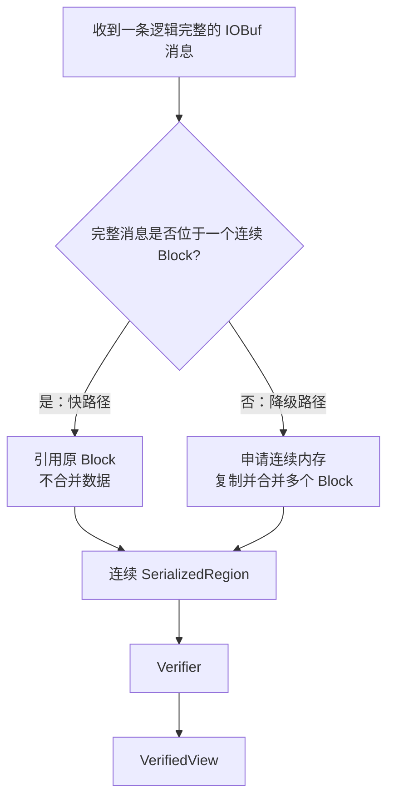

### 快路径

```text
单个连续 IOBuf Block → Region 引用原内存 → Verifier → View
```

可以做到接收端不合并复制，同时免去完整反序列化。

### 降级路径

```text
多个不连续 Block → 合并复制 → 连续 Region → Verifier → View
```

发生了一次复制，但仍不需要构造完整对象树。业务接口无需因底层布局不同而改变。

## 8. View 与 Region 的生命周期

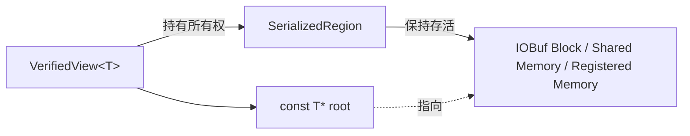

必须保证：

```text
View 的有效期 ≤ Region 的有效期
```

如果只保存 `const T*`，底层 IOBuf 被释放后该指针会悬空。跨 RPC 回调持有数据时，业务必须显式取得 Region 所有权或复制需要长期保存的数据。

## 9. FlatBuffers 接入 bRPC 的两种路线

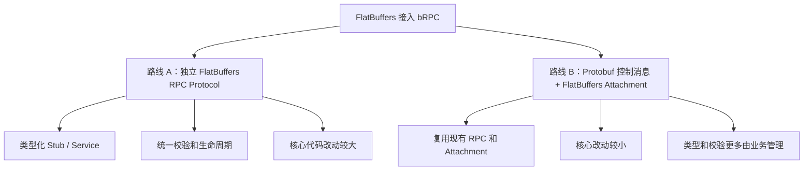

| 路线 | 优点 | 主要代价 |
|---|---|---|
| 独立 Protocol | 类型化接口完整，可统一生成 Stub/Service | 修改 Channel、Controller、Server，维护成本高 |
| Attachment View | MVP 快、对核心侵入较小 | 类型和校验不够自动化，用户接口不够自然 |

这是本次评审需要重点决定的问题。

## 10. 历史 PR 与当前工作的关系

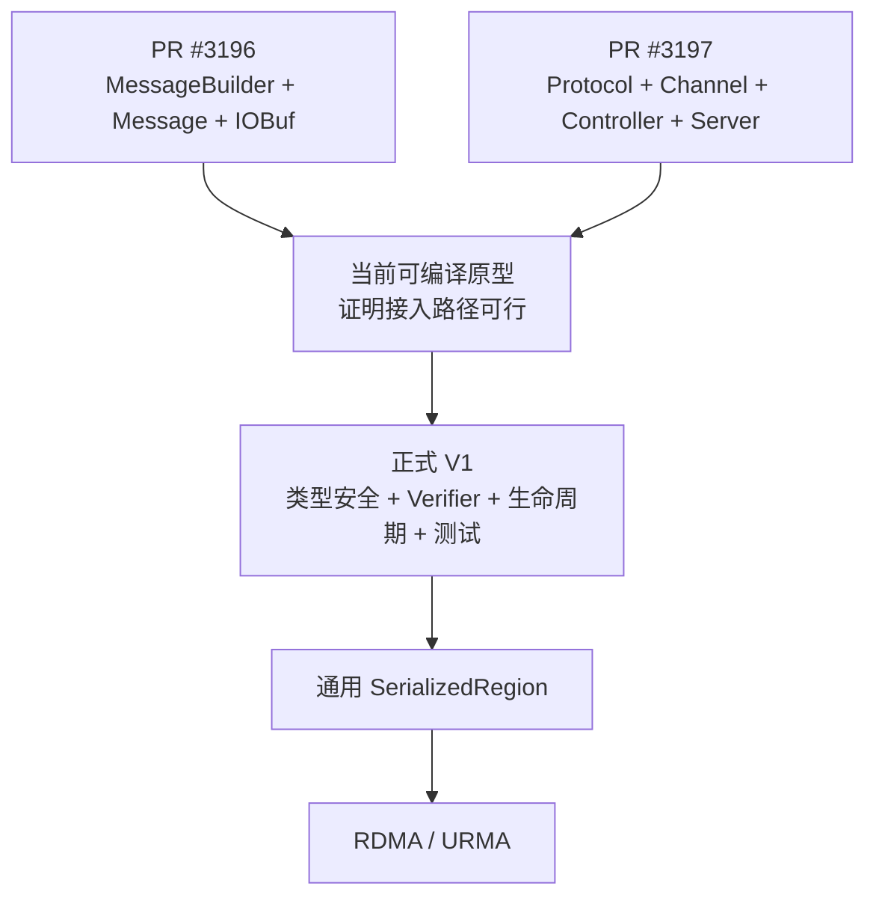

- PR #3196 回答消息怎样构造、持有和访问；
- PR #3197 回答消息怎样进入完整 RPC 请求/响应链路；
- 当前原型用于证明“能否接入”；
- 正式实现还要解决类型安全、校验、生命周期、兼容性和测试。

## 11. 分阶段实施路线

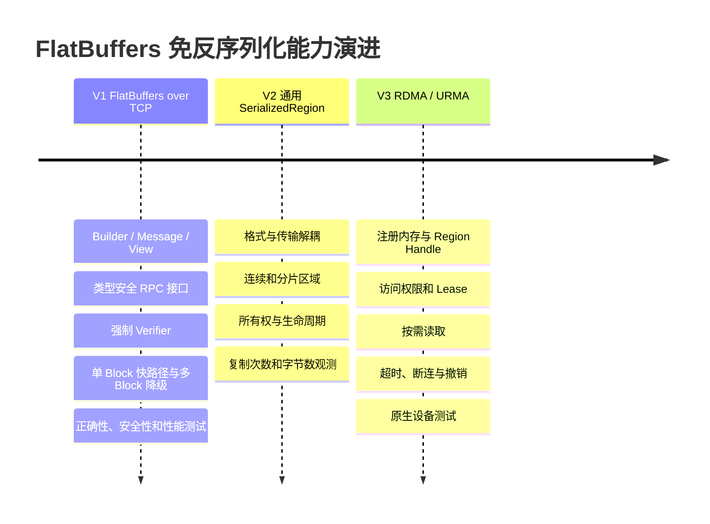

V1 可以在本地 WSL 完成；V3 才需要具有 RDMA/URMA 设备的原生 Linux 环境。

## 12. 当前状态


准确状态是：

> FlatBuffers builder/protocol 的可编译原型已经打通，但尚未形成可向社区提交的正式功能实现。

## 13. 希望会议确认的事项

1. 是否认可“FlatBuffers over TCP → 通用 Region → RDMA/URMA”的路线？
2. V1 是否只承诺免反序列化和条件式零拷贝快路径？
3. FlatBuffers 应采用独立 Protocol 还是 Attachment View？
4. 是否接受 FlatBuffers 为可选依赖？
5. 接收端是否必须执行类型专用 Verifier？
6. V1 是否允许多分片输入合并复制？
7. View 能否跨 RPC 回调持有，采用何种所有权接口？
8. 历史 PR 中哪些机制保留，哪些接口重写？
9. 哪些正确性、安全性和性能指标作为合入门槛？

## 14. 建议结论

```text
先保证正确和安全
        ↓
再验证免反序列化收益
        ↓
再优化连续缓冲区零拷贝快路径
        ↓
最后推广至 RDMA/URMA
```

建议暂不把当前历史 PR 移植代码作为正式功能提交。先完成类型安全接口、强制校验、生命周期规则和 TCP 测试，再根据可复现证据提取通用 Region。

## 15. 相关链接

- 内部方案 PR：<https://github.com/LinQuickDev/brpc/pull/44>
- Apache bRPC：<https://github.com/apache/brpc>
- 历史 Builder PR：<https://github.com/apache/brpc/pull/3196>
- 历史 Protocol PR：<https://github.com/apache/brpc/pull/3197>
- FlatBuffers：<https://github.com/google/flatbuffers>

