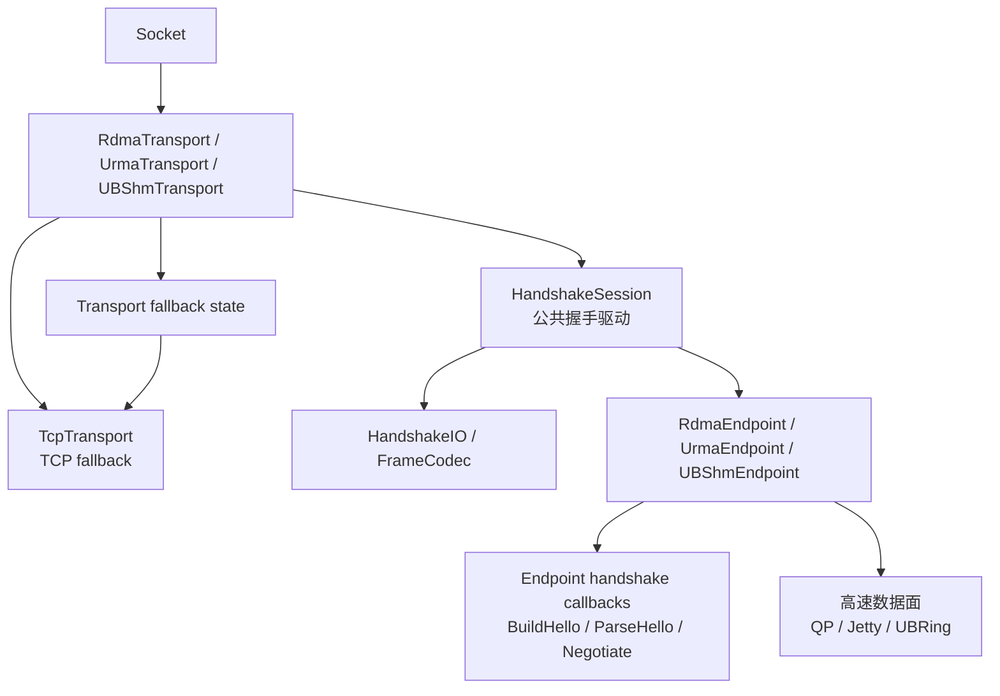
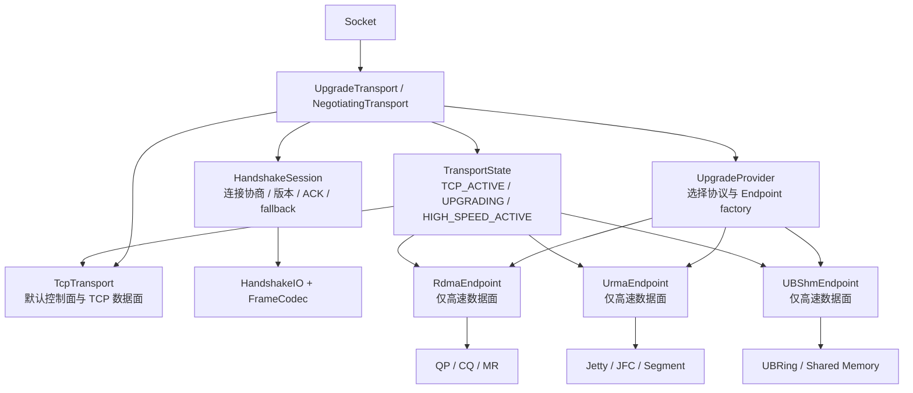
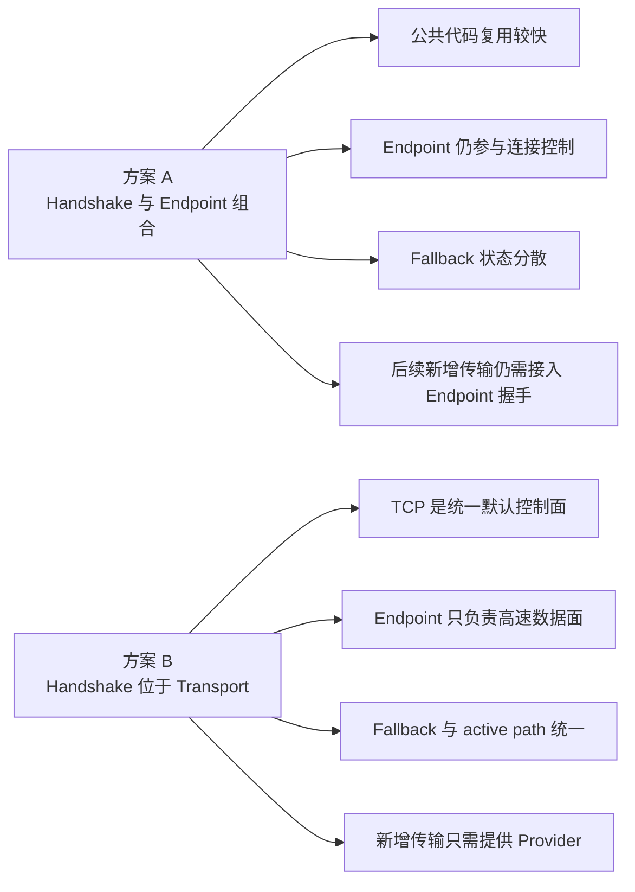
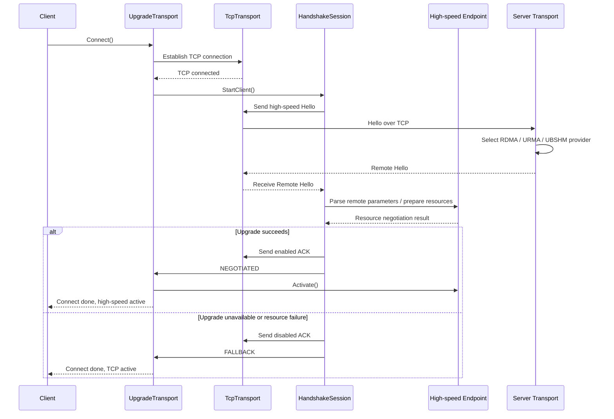

# RDMA、URMA 与 UBSHM 公共握手组件设计方案

## 1. 背景

brpc 当前有三种基于 TCP 建立控制连接、再切换到高速数据面的传输：

- RDMA：`src/brpc/rdma/rdma_endpoint.*`
- URMA：`src/brpc/urma/urma_endpoint.*`
- UBSHM/UBRING：`src/brpc/ubshm/ub_endpoint.*`

三套实现都包含以下流程：

```text
TCP 连接建立
    -> 发送本地 Hello
    -> 接收并校验对端 Hello
    -> 创建或导入高速传输资源
    -> 返回协商结果/ACK
    -> 成功切换高速通道，或回退到 TCP
```

目前公共流程主要以复制代码的形式存在。例如：

- RDMA 的 TCP 握手读写循环在 `rdma_endpoint.cpp` 中实现；
- URMA 在 `urma_endpoint.cpp` 中重新实现了一套；
- UBSHM 在 `ub_endpoint.cpp` 中再次实现了一套；
- 三套实现都维护独立的握手状态枚举、client/server 流程和 fallback 逻辑。

本方案只抽取握手公共组件，不尝试合并 RDMA QP、URMA Jetty 或 UBSHM ring 的数据面实现。

## 2. 现状分析

### 2.1 RDMA

RDMA 支持：

- v2 二进制握手：`RDMA` magic；
- v3 protobuf 握手：`RDM3` magic；
- client/server 两套解析路径；
- server 侧基于 `butil::IOBuf` 的增量解析；
- 非 RDMA 连接的 TCP fallback；
- 4 字节 ACK。

相关代码：

- `src/brpc/rdma/rdma_handshake.h`
- `src/brpc/rdma/rdma_handshake.cpp`
- `src/brpc/rdma/rdma_handshake_server.cpp`

### 2.2 URMA

URMA 的握手结构与 RDMA 类似，但 payload 完全不同：

- v2 二进制握手：`URMA` magic；
- v3 protobuf 握手：`URM3` magic；
- Hello 中携带 EID、UASID、Jetty、segment 和 token 信息；
- 需要先导入 remote segment，再导入 remote Jetty；
- 目前 server/client 主要由 `UrmaEndpoint` 自己驱动。

相关代码：

- `src/brpc/urma/urma_handshake.h`
- `src/brpc/urma/urma_handshake.cpp`
- `src/brpc/urma/urma_endpoint.cpp`

### 2.3 UBSHM/UBRING

UBSHM 当前使用固定长度二进制握手：

```text
[ "UB" 2B ][ HelloMessage 62B ]
```

Hello 中携带：

- `msg_len`
- `hello_ver`
- `impl_ver`
- shared memory 长度
- shared memory 名称

握手成功后，通过 ACK 中的 `UB_OK` bit 表示是否切换到 UBRING；失败时回退 TCP。

相关代码：

- `src/brpc/ubshm/ub_endpoint.h`
- `src/brpc/ubshm/ub_endpoint.cpp:63`
- `src/brpc/ubshm/ub_endpoint.cpp:331`
- `src/brpc/ubshm/ub_endpoint.cpp:460`

## 3. 设计目标

### 3.1 目标

1. 消除三套实现中的 TCP 握手读写重复代码。
2. 统一 magic、长度、版本、ACK、fallback 和错误结果的处理方式。
3. 支持 client 阻塞式读取和 server 基于 `IOBuf` 的增量读取。
4. 保持 RDMA、URMA、UBSHM 的现有 wire format 完全兼容。
5. 让协议 payload 和高速资源协商逻辑继续由各传输实现负责。
6. 在未开启某一传输宏时，公共组件仍可独立编译。

### 3.2 非目标

本次不抽取以下内容：

- RDMA QP/CQ/PD/MR 创建和销毁；
- URMA Jetty/JFR/JFC/segment 导入；
- UBSHM ring 和 shared memory 映射；
- RDMA、URMA、UBSHM 的数据面 completion 处理；
- 三种传输的内存池；
- 三种传输的 poller/CQ 事件线程。

这些组件虽然也存在结构相似性，但资源模型不同，过早抽象会导致公共接口暴露 `ibv_*`、`urma_*` 或 UBRING 类型。

## 4. 总体架构

新增公共目录：

```text
src/brpc/handshake/
    handshake_common.h       # 结果、角色、错误和阶段定义
    handshake_io.h            # 字节流抽象
    handshake_io.cpp
    handshake_frame.h         # magic/长度/增量帧解析工具
    handshake_frame.cpp
    handshake_driver.h        # 通用握手驱动
    handshake_driver.cpp
```

总体关系如下：

```text
                 +--------------------------+
                 |     HandshakeDriver       |
                 | client/server state flow  |
                 +------------+-------------+
                              |
                 +------------v-------------+
                 |   HandshakeProtocol       |
                 | build/parse/validate hello|
                 | build/parse ack           |
                 +--+-------------+----------+
                    |             |
          +---------v--+     +----v---------+
          | HandshakeIO|     | FrameCodec   |
          | read/write |     | magic/length |
          +---------+--+     +--------------+
                    |
       +------------+-------------+-------------+
       |                          |             |
  RDMA adapter               URMA adapter   UBSHM adapter
```

公共组件只负责握手过程和字节帧，不负责判断“创建 QP、导入 Jetty 还是映射 SHM”。

## 4.1 两种候选架构对比

本节同时保留两种方案，便于社区讨论握手组件应该放在哪一层。

### 方案 A：公共握手组件与各类 Endpoint 组合

这是上一版设计的方向：公共组件提供 `HandshakeIO`、`FrameCodec` 和部分握手驱动，各类 Transport/Endpoint 负责组合调用。TCP fallback 仍由具体 Transport 维护，Endpoint 仍可能参与握手生命周期。



该方案可以先复用 frame 和 I/O 代码，改动较小；但握手生命周期仍然横跨 Transport 和 Endpoint，Endpoint 与 TCP 控制连接之间仍存在一定耦合。

### 方案 B：Handshake 放到 Transport 上层，Endpoint 只负责数据面

这是本次建议的方向：默认先建立 TCP 连接，客户端可以请求升级到 RDMA、URMA 或 UBSHM。握手、升级决策、fallback 和 active transport 选择全部由上层 Transport 负责。



方案 B 中，Endpoint 不再执行 TCP fd 读写、magic 判断、握手 bthread 或 TCP fallback。它只向 Transport 提供资源准备、Hello payload、远端参数应用和数据面操作。

### 两种方案的主要差异



## 4.2 方案 B 的连接升级时序

### 客户端请求高速传输



### 服务端识别客户端请求


## 5. 核心接口设计

### 5.1 统一结果类型

```cpp
namespace brpc {
namespace handshake {

enum class Role {
    CLIENT,
    SERVER,
};

enum class Result {
    NEGOTIATED,
    FALLBACK,
    NEED_MORE_DATA,
    IO_ERROR,
    PROTOCOL_ERROR,
    RESOURCE_ERROR,
};

enum class Phase {
    INIT,
    HELLO_SEND,
    HELLO_WAIT,
    RESOURCE_NEGOTIATION,
    ACK_SEND,
    ACK_WAIT,
    ESTABLISHED,
    FALLBACK_TCP,
    FAILED,
};

}  // namespace handshake
}  // namespace brpc
```

这可以统一当前 RDMA 的 `RemoteHelloResult` 和 URMA 的 `int + bool negotiated`，也覆盖 UBSHM 的状态转换。

### 5.2 字节流接口

握手组件不能直接依赖 `Socket`，否则公共组件会被 brpc endpoint 的私有状态和不同的 server 解析方式绑死。

建议提供两个方向的接口：

```cpp
class HandshakeIO {
public:
    virtual ~HandshakeIO() = default;

    // Client 或握手 bthread 使用：必须读满 len 字节。
    virtual Result ReadExact(void* data, size_t len) = 0;

    // 必须写完全部数据。
    virtual Result WriteAll(const void* data, size_t len) = 0;

    // 将已经读取但不属于当前握手的数据放回 TCP 输入缓冲区。
    virtual Result PushBack(const void* data, size_t len) = 0;
};

class HandshakeInput {
public:
    virtual ~HandshakeInput() = default;

    // Server 的 InputMessenger 使用：只查看，不消费。
    virtual size_t Size() const = 0;
    virtual bool CopyTo(void* data, size_t len) const = 0;

    // 仅在帧已经完整时消费。
    virtual bool Consume(size_t len) = 0;
};
```

实现方式：

- client：把当前 `ReadFromFd/WriteToFd` 封装成 `SocketHandshakeIO`；
- server：把 `butil::IOBuf` 封装成 `IOBufHandshakeInput`；
- UBSHM 当前 server 也使用 fd 读取，可先使用 `SocketHandshakeIO`，后续再迁移到增量解析；
- RDMA 的 `rdma_handshake_server.cpp` 可以直接使用 `HandshakeInput`。

### 5.3 FrameCodec

FrameCodec 只处理 framing，不理解 RDMA、URMA 或 UBSHM 的业务字段。

```cpp
struct FrameSpec {
    const char* magic;
    size_t magic_len;
    size_t min_frame_len;
    size_t max_frame_len;
    enum LengthEncoding {
        FIXED,
        U16_TOTAL_LENGTH,
        U32_BODY_LENGTH,
    } length_encoding;
};

class FrameCodec {
public:
    static Result ReadMagic(HandshakeIO* io,
                            const FrameSpec& spec,
                            std::string* magic);

    static Result ReadFrame(HandshakeIO* io,
                            const FrameSpec& spec,
                            std::string* frame);

    static Result ParseBufferedFrame(HandshakeInput* input,
                                      const FrameSpec& spec,
                                      std::string* frame);

    static Result DrainFrame(HandshakeIO* io,
                             const FrameSpec& spec);
};
```

三种协议可以配置为：

| 传输 | 版本 | Magic | Framing |
|---|---:|---|---|
| RDMA | v2 | `RDMA` | U16，总长度 |
| RDMA | v3 | `RDM3` | U32，body 长度 |
| URMA | v2 | `URMA` | U16，总长度 |
| URMA | v3 | `URM3` | U32，body 长度 |
| UBSHM | v2 | `UB` | 固定长度 64 字节 |

特别注意：`magic_len` 不能固定为 4。UBSHM 使用 2 字节 magic，因此公共组件必须以 `FrameSpec` 为准，而不能复用 RDMA 的 `HELLO_MAGIC_LEN`。

### 5.4 协议适配器

每个传输提供自己的协议适配器：

```cpp
class HandshakeProtocol {
public:
    virtual ~HandshakeProtocol() = default;

    virtual int Version() const = 0;
    virtual const FrameSpec& HelloFrameSpec() const = 0;

    // 构造本地 Hello payload。
    virtual Result BuildHello(std::string* out,
                              bool negotiable) = 0;

    // 校验并解析对端 Hello；只做协议层校验。
    virtual Result ParseHello(const std::string& frame,
                              std::shared_ptr<void>* parsed) = 0;

    // 交给具体 endpoint 创建/导入高速资源。
    virtual Result Negotiate(void* parsed) = 0;

    // 构造和解析传输特有 ACK。
    virtual Result BuildAck(bool enabled, std::string* out) = 0;
    virtual Result ParseAck(const std::string& ack, bool* enabled) = 0;
};
```

实际实现中不建议使用裸 `shared_ptr<void>`，更适合使用各协议自己的 `ParsedHello` 结构配合回调，或者让 `HandshakeDriver` 只传递 `std::string payload`，由 endpoint 在回调中解析。

建议第一版采用回调方式，避免公共头文件包含协议专有类型：

```cpp
struct HandshakeCallbacks {
    std::function<Result(std::string* hello)> build_hello;
    std::function<Result(const std::string& hello)> parse_remote_hello;
    std::function<Result(bool enabled, std::string* ack)> build_ack;
    std::function<Result(const std::string& ack, bool* enabled)> parse_ack;
    std::function<Result()> negotiate_resources;
};
```

## 6. HandshakeDriver 状态机

### 6.1 Client 流程

```text
INIT
  -> build_hello
  -> send_hello
  -> receive_remote_hello
  -> parse/validate
  -> negotiate_resources
  -> receive_remote_ack 或发送本地 ACK
  -> ESTABLISHED
```

任一步骤发现对端不支持当前高速传输时：

```text
FALLBACK_TCP
  -> 保留/回放未消费的 TCP 数据
  -> 交给 InputMessenger/TcpTransport
```

### 6.2 Server 流程

```text
UNINIT
  -> 读取 magic
  -> 根据 magic/version 选择协议适配器
  -> 读取完整 Hello
  -> parse/validate
  -> negotiate_resources
  -> send local Hello
  -> receive client ACK
  -> ESTABLISHED 或 FALLBACK_TCP
```

server 解析必须保留 `NEED_MORE_DATA`：

- RDMA 的 policy parser 可能多次收到 `IOBuf` 片段；
- 后续 URMA/UBSHM 如果接入统一 server parser，也需要同样行为；
- 未读完整时不得消费输入缓冲区。

### 6.3 公共驱动不负责的动作

`HandshakeDriver` 在协议成功后只调用回调，不直接操作资源：

- RDMA：回调中执行 `AllocateResources/BringUpQp`；
- URMA：回调中执行 `AllocateResources/ImportPeer`；
- UBSHM：回调中执行 `AllocateClientResources/AllocateServerResources`。

这样可以保证握手公共组件不依赖三种数据面 API。

## 7. 三种传输的适配方式

### 7.1 RDMAAdapter

保留：

- `ParsedHello`；
- `HelloMessage` 序列化和反序列化；
- RDMA v2/v3 protobuf；
- ECE 校验和 QP 参数处理；
- `BringUpQp`；
- RDMA 专属 fallback hello。

迁移后由 adapter 提供：

```text
BuildHello -> FillLocalRdmaHello
ParseHello -> ValidRdmaHello + TranslateHello
Negotiate  -> ApplyRemoteHello + BringUpQp
BuildAck   -> RDMA ACK
```

### 7.2 URMAAdapter

保留：

- EID/UASID/Jetty/segment/token 字段；
- URMA v2/v3 protobuf；
- `ValidHello`；
- `ImportPeer`；
- URMA bonding 相关逻辑。

迁移后由 adapter 提供：

```text
BuildHello -> FillLocalHelloV2/FillLocalHelloV3
ParseHello -> ValidHello + ParsedHello
Negotiate  -> ApplyRemoteHello + ImportPeer
BuildAck   -> URMA ACK
```

### 7.3 UBSHMAdapter

保留：

- `HelloMessage`；
- `HelloMessage::Serialize/Deserialize`；
- `HelloNegotiationValid`；
- shared memory 名称和长度校验；
- `AllocateClientResources/AllocateServerResources`；
- `UB_OK` ACK bit。

迁移后由 adapter 提供：

```text
BuildHello -> 填充 UB HelloMessage
ParseHello -> 校验 hello_ver/impl_ver/msg_len
Negotiate  -> 创建或映射 SHM/ring
BuildAck   -> 4 字节 UB flags
```

UBSHM 是最适合优先迁移的实现，因为它只有固定长度 v2 协议，不涉及 protobuf 和多版本 frame dispatch。

## 8. 与现有 Endpoint 的关系

不建议让 `RdmaEndpoint`、`UrmaEndpoint`、`UBShmEndpoint` 继承一个包含大量虚函数的“大 Endpoint 基类”。更合适的方式是组合：

```cpp
class RdmaEndpoint {
    handshake::HandshakeDriver _handshake;
    RdmaHandshakeAdapter _handshake_adapter;
};

class UrmaEndpoint {
    handshake::HandshakeDriver _handshake;
    UrmaHandshakeAdapter _handshake_adapter;
};

class UBShmEndpoint {
    handshake::HandshakeDriver _handshake;
    UBShmHandshakeAdapter _handshake_adapter;
};
```

Endpoint 仍然拥有：

- Socket；
- transport-specific resource；
- endpoint state 的业务动作；
- data path；
- InputMessenger 回调；
- transport-specific error handling。

公共 driver 只拥有握手阶段和 protocol callback，不拥有 endpoint 生命周期。

## 9. 兼容性和安全约束

### 9.1 Wire compatibility

重构前后必须保持：

- magic 不变；
- v2/v3 版本号不变；
- 长度字段的字节序和语义不变；
- ACK 长度和 bit 定义不变；
- fallback hello 的无效字段规则不变；
- RDMA/URMA/UBSHM 之间不能误识别 magic。

### 9.2 长度校验

FrameCodec 必须统一执行：

- 最小帧长度检查；
- 最大帧长度限制；
- 整数溢出检查；
- 长度字段是否包含 magic 的明确配置；
- protobuf body 长度限制；
- 固定长度协议的精确长度检查。

### 9.3 fallback 数据处理

当 magic 不匹配时：

- client 侧按现有协议处理错误或回退；
- server 侧必须将已经读取的 magic 放回 `_read_buf`，再交给 TCP parser；
- 任何已经确认属于高速协议的完整帧，不能直接交给普通 TCP parser。

### 9.4 资源失败

协议格式正确不代表高速传输一定可用：

```text
Hello valid
    -> resource allocation/import failed
    -> send non-negotiable hello or disabled ACK
    -> fallback TCP
```

因此 `ParseHello` 和 `Negotiate` 必须保持两个独立步骤。

## 10. 测试方案

### 10.1 公共组件单元测试

覆盖：

- magic 长度为 2 和 4；
- fixed/U16/U32 三种 framing；
- 半包读取；
- 多余数据 drain；
- 最大长度和最小长度；
- 长度字段溢出；
- magic 不匹配并 push-back；
- `NEED_MORE_DATA` 时不消费输入 buffer；
- IO error、EOF、超时。

### 10.2 协议适配器测试

分别测试：

- RDMA v2/v3 hello；
- URMA v2/v3 hello；
- UBSHM v2 hello；
- invalid hello fallback；
- ACK enabled/disabled；
- resource negotiation failure。

### 10.3 兼容性测试

至少保留以下组合：

| Client | Server | 预期 |
|---|---|---|
| RDMA v2 | RDMA v2 | RDMA |
| RDMA v3 | RDMA v3 | RDMA |
| URMA v2 | URMA v2 | URMA |
| URMA v3 | URMA v3 | URMA |
| UBSHM | UBSHM | UBSHM |
| 高速 client | TCP server | TCP fallback |
| TCP client | 高速 server | TCP fallback |
| 高速资源失败 | 高速对端 | TCP fallback |

## 11. 分阶段实施计划

### Phase 0：建立行为基线

- 为 RDMA、URMA、UBSHM 现有 handshake 增加或补齐单元测试；
- 固化现有 wire format 样例；
- 记录状态转换和 fallback 行为。

### Phase 1：抽取公共 I/O 和 framing

- 新增 `src/brpc/handshake/handshake_io.*`；
- 新增 `src/brpc/handshake/handshake_frame.*`；
- 先迁移 UBSHM 固定长度握手；
- 再迁移 URMA v2；
- 最后迁移 RDMA v2/v3。

### Phase 2：抽取公共 driver

- 引入统一 `Result/Phase`；
- 将 client/server 的握手阶段迁移到 `HandshakeDriver`；
- 保留各 endpoint 的资源协商回调；
- 统一 fallback 和错误处理。

### Phase 3：清理旧实现

- 删除三套重复的 `ReadFromFd/WriteToFd` 握手代码；
- 删除可替代的 magic/length 解析代码；
- 保留各协议的 wire codec 和资源适配器；
- 更新 CMake、Bazel 和相关测试目标。

## 12. 主要风险和规避方式

### 风险一：公共抽象过度绑定 Socket

规避：公共组件只使用 `HandshakeIO`/`HandshakeInput`，不直接包含 `brpc/socket.h`。

### 风险二：混淆不同长度字段语义

RDMA/URMA/UBSHM 的长度字段并不完全相同。规避：使用 `FrameSpec::LengthEncoding`，并在每个协议 adapter 中明确配置。

### 风险三：server 增量解析行为改变

规避：公共 `ParseBufferedFrame` 在完整帧可用前只返回 `NEED_MORE_DATA`，不消费任何数据。

### 风险四：握手成功后资源失败被误认为协议失败

规避：将 `ParseHello` 与 `Negotiate` 分离，资源失败统一转换成可配置的 fallback 行为。

### 风险五：UBSHM 的 2 字节 magic 被 4 字节假设破坏

规避：所有 magic 操作都依赖 `FrameSpec.magic_len`，禁止公共代码写死 4。

## 13. 结论

建议抽取的公共组件边界是：

```text
公共：TCP 握手 I/O、frame framing、magic/length、增量解析、状态驱动、ACK/fallback 结果
私有：Hello payload、版本语义、资源协商、QP/Jetty/SHM 创建、数据面 completion
```

实施上优先从 UBSHM 固定长度握手开始，再迁移 URMA 和 RDMA。这样可以先验证公共组件的接口，不需要一开始处理 RDMA/URMA 的 protobuf、多版本和复杂资源依赖。
