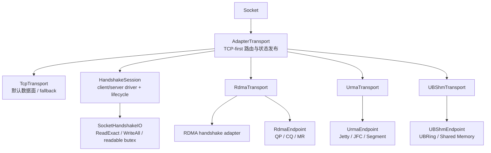
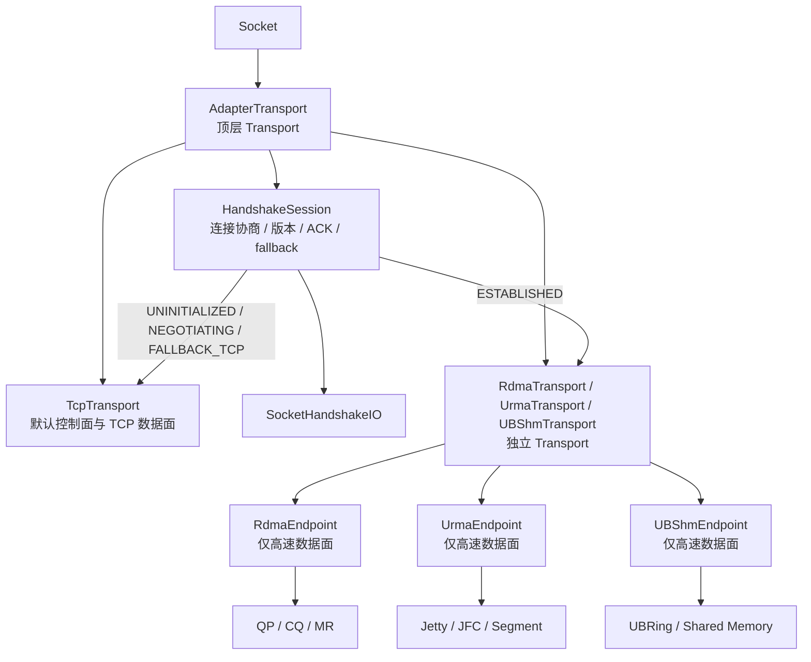
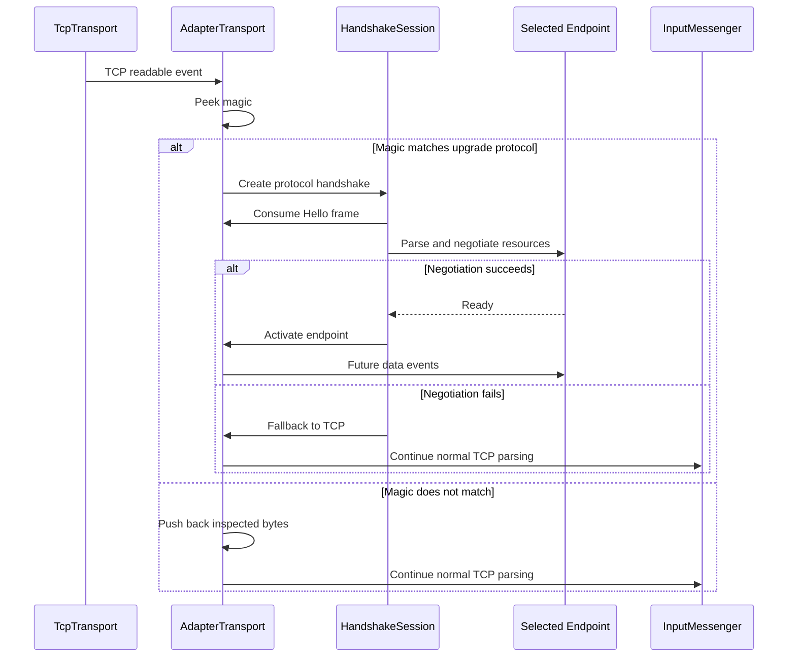
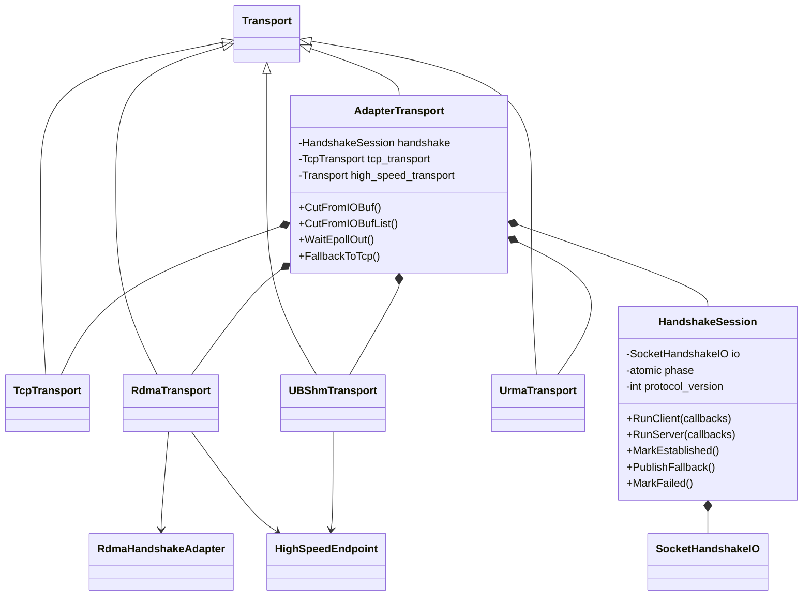

# RDMA、URMA 与 UBSHM 公共握手组件设计方案

## 1. 背景

brpc 当前有三种基于 TCP 建立控制连接、再切换到高速数据面的传输：

- RDMA：`src/brpc/rdma/rdma_endpoint.*`
- URMA：`src/brpc/urma/urma_endpoint.*`
- UBSHM/UBRING：`src/brpc/ubshm/ub_endpoint.*`

三套实现都包含以下流程：

```text
TCP 连接建立
    -> 发送本地 Hello
    -> 接收并校验对端 Hello
    -> 创建或导入高速传输资源
    -> 返回协商结果/ACK
    -> 成功切换高速通道，或回退到 TCP
```

目前公共流程主要以复制代码的形式存在。例如：

- RDMA 的 TCP 握手读写循环在 `rdma_endpoint.cpp` 中实现；
- URMA 在 `urma_endpoint.cpp` 中重新实现了一套；
- UBSHM 在 `ub_endpoint.cpp` 中再次实现了一套；
- 三套实现都维护独立的握手状态枚举、client/server 流程和 fallback 逻辑。

本方案只抽取握手公共组件，不尝试合并 RDMA QP、URMA Jetty 或 UBSHM ring 的数据面实现。

## 2. 现状分析

### 2.1 RDMA

RDMA 支持：

- v2 二进制握手：`RDMA` magic；
- v3 protobuf 握手：`RDM3` magic；
- client/server 两套解析路径；
- server 侧基于 `butil::IOBuf` 的增量解析；
- 非 RDMA 连接的 TCP fallback；
- 4 字节 ACK。

相关代码：

- `src/brpc/rdma_handshake.h`
- `src/brpc/rdma_handshake.cpp`
- `src/brpc/rdma_handshake_server.cpp`

### 2.2 URMA

URMA 的握手结构与 RDMA 类似，但 payload 完全不同：

- v2 二进制握手：`URMA` magic；
- v3 protobuf 握手：`URM3` magic；
- Hello 中携带 EID、UASID、Jetty、segment 和 token 信息；
- 需要先导入 remote segment，再导入 remote Jetty；
- 目前 server/client 主要由 `UrmaEndpoint` 自己驱动。

相关代码：

- `src/brpc/urma/urma_handshake.h`
- `src/brpc/urma/urma_handshake.cpp`
- `src/brpc/urma/urma_endpoint.cpp`

### 2.3 UBSHM/UBRING

UBSHM 当前使用固定长度二进制握手：

```text
[ "UB" 2B ][ HelloMessage 62B ]
```

Hello 中携带：

- `msg_len`
- `hello_ver`
- `impl_ver`
- shared memory 长度
- shared memory 名称

握手成功后，通过 ACK 中的 `UB_OK` bit 表示是否切换到 UBRING；失败时回退 TCP。

相关代码：

- `src/brpc/ubshm/ub_endpoint.h`
- `src/brpc/ubshm/ub_endpoint.cpp:63`
- `src/brpc/ubshm/ub_endpoint.cpp:331`
- `src/brpc/ubshm/ub_endpoint.cpp:460`

## 3. 设计目标

### 3.1 目标

1. 消除三套实现中的 TCP 握手读写重复代码。
2. 统一 magic、长度、版本、ACK、fallback 和错误结果的处理方式。
3. 支持 client 阻塞式读取和 server 基于 `IOBuf` 的增量读取。
4. 保持 RDMA、URMA、UBSHM 的现有 wire format 完全兼容。
5. 让协议 payload 和高速资源协商逻辑继续由各传输实现负责。
6. 在未开启某一传输宏时，公共组件仍可独立编译。

### 3.2 非目标

本次不抽取以下内容：

- RDMA QP/CQ/PD/MR 创建和销毁；
- URMA Jetty/JFR/JFC/segment 导入；
- UBSHM ring 和 shared memory 映射；
- RDMA、URMA、UBSHM 的数据面 completion 处理；
- 三种传输的内存池；
- 三种传输的 poller/CQ 事件线程。

这些组件虽然也存在结构相似性，但资源模型不同，过早抽象会导致公共接口暴露 `ibv_*`、`urma_*` 或 UBRING 类型。

## 4. 总体架构

公共抽象放在 `src/brpc` 的 Transport 层：

```text
src/brpc/
    adapter_transport.h/.cpp     # Socket 顶层 Transport、TCP-first 路由与状态发布
    transport_handshake.h/.cpp   # HandshakeSession 与 SocketHandshakeIO
    rdma_handshake.h/.cpp        # RDMA v2/v3 wire adapter
    rdma_handshake_server.h/.cpp # RDMA 标准 server parser/fallback
    rdma_handshake.proto         # RDMA v3 wire message
    rdma_transport.h/.cpp        # 独立 RDMA Transport、握手回调与数据面
    ubshm_transport.h/.cpp       # 独立 UBSHM Transport、握手回调与数据面
```

总体关系如下：



`Socket::_transport` 始终指向最上层的 `AdapterTransport`。它组合一个默认 `TcpTransport` 和至多一个独立的 `RdmaTransport`、`UrmaTransport` 或 `UBShmTransport`，并决定当前数据走哪个 Transport。`HandshakeSession` 驱动一次升级尝试的公共步骤；具体协议 adapter 通过回调完成 Hello/ACK wire codec 和资源协商。Endpoint 不持有 TCP Transport，也不执行 TCP fd 读写。

## 4.1 选定架构：Handshake 位于 Transport 层

默认先建立 TCP 连接，客户端可以请求升级到 RDMA、URMA 或 UBSHM。握手、升级决策、fallback 和 active transport 选择全部由 `AdapterTransport` 负责。



RDMA、URMA、UBSHM 仍然是完整的 `Transport` 实现，负责各自的高速发送、等待、事件派发和消息调度；它们不再继承 `AdapterTransport`。在该架构中，Endpoint 不再执行 TCP fd 读写、magic 判断、握手 bthread 或 TCP fallback，只向对应 Transport 提供资源准备、远端参数应用和数据面操作。

## 4.2 连接升级时序

### 客户端请求高速传输


### 服务端识别客户端请求



## 5. 核心接口设计

### 5.1 统一结果类型

```cpp
namespace brpc {
namespace handshake {

enum class Role {
    CLIENT,
    SERVER,
};

enum class Result {
    NEGOTIATED,
    FALLBACK,
    NEED_MORE_DATA,
    IO_ERROR,
    PROTOCOL_ERROR,
    RESOURCE_ERROR,
};

enum class Phase {
    INIT,
    HELLO_SEND,
    HELLO_WAIT,
    RESOURCE_NEGOTIATION,
    ACK_SEND,
    ACK_WAIT,
    ESTABLISHED,
    FALLBACK_TCP,
    FAILED,
};

}  // namespace handshake
}  // namespace brpc
```

这可以统一当前 RDMA 的 `RemoteHelloResult` 和 URMA 的 `int + bool negotiated`，也覆盖 UBSHM 的状态转换。

### 5.2 字节流接口

握手组件不能直接依赖 `Socket`，否则公共组件会被 brpc endpoint 的私有状态和不同的 server 解析方式绑死。

建议提供两个方向的接口：

```cpp
class HandshakeIO {
public:
    virtual ~HandshakeIO() = default;

    // Client 或握手 bthread 使用：必须读满 len 字节。
    virtual Result ReadExact(void* data, size_t len) = 0;

    // 必须写完全部数据。
    virtual Result WriteAll(const void* data, size_t len) = 0;

    // 将已经读取但不属于当前握手的数据放回 TCP 输入缓冲区。
    virtual Result PushBack(const void* data, size_t len) = 0;
};

class HandshakeInput {
public:
    virtual ~HandshakeInput() = default;

    // Server 的 InputMessenger 使用：只查看，不消费。
    virtual size_t Size() const = 0;
    virtual bool CopyTo(void* data, size_t len) const = 0;

    // 仅在帧已经完整时消费。
    virtual bool Consume(size_t len) = 0;
};
```

实现方式：

- client：把当前 `ReadFromFd/WriteToFd` 封装成 `SocketHandshakeIO`；
- server：把 `butil::IOBuf` 封装成 `IOBufHandshakeInput`；
- UBSHM 当前 server 也使用 fd 读取，可先使用 `SocketHandshakeIO`，后续再迁移到增量解析；
- RDMA 的 `rdma_handshake_server.cpp` 可以直接使用 `HandshakeInput`。

### 5.3 FrameCodec

FrameCodec 只处理 framing，不理解 RDMA、URMA 或 UBSHM 的业务字段。

```cpp
struct FrameSpec {
    const char* magic;
    size_t magic_len;
    size_t min_frame_len;
    size_t max_frame_len;
    enum LengthEncoding {
        FIXED,
        U16_TOTAL_LENGTH,
        U32_BODY_LENGTH,
    } length_encoding;
};

class FrameCodec {
public:
    static Result ReadMagic(HandshakeIO* io,
                            const FrameSpec& spec,
                            std::string* magic);

    static Result ReadFrame(HandshakeIO* io,
                            const FrameSpec& spec,
                            std::string* frame);

    static Result ParseBufferedFrame(HandshakeInput* input,
                                      const FrameSpec& spec,
                                      std::string* frame);

    static Result DrainFrame(HandshakeIO* io,
                             const FrameSpec& spec);
};
```

三种协议可以配置为：

| 传输 | 版本 | Magic | Framing |
|---|---:|---|---|
| RDMA | v2 | `RDMA` | U16，总长度 |
| RDMA | v3 | `RDM3` | U32，body 长度 |
| URMA | v2 | `URMA` | U16，总长度 |
| URMA | v3 | `URM3` | U32，body 长度 |
| UBSHM | v2 | `UB` | 固定长度 64 字节 |

特别注意：`magic_len` 不能固定为 4。UBSHM 使用 2 字节 magic，因此公共组件必须以 `FrameSpec` 为准，而不能复用 RDMA 的 `HELLO_MAGIC_LEN`。

### 5.4 协议适配器

每个传输提供自己的协议适配器：

```cpp
class HandshakeProtocol {
public:
    virtual ~HandshakeProtocol() = default;

    virtual int Version() const = 0;
    virtual const FrameSpec& HelloFrameSpec() const = 0;

    // 构造本地 Hello payload。
    virtual Result BuildHello(std::string* out,
                              bool negotiable) = 0;

    // 校验并解析对端 Hello；只做协议层校验。
    virtual Result ParseHello(const std::string& frame,
                              std::shared_ptr<void>* parsed) = 0;

    // 交给具体 endpoint 创建/导入高速资源。
    virtual Result Negotiate(void* parsed) = 0;

    // 构造和解析传输特有 ACK。
    virtual Result BuildAck(bool enabled, std::string* out) = 0;
    virtual Result ParseAck(const std::string& ack, bool* enabled) = 0;
};
```

实际实现中不建议使用裸 `shared_ptr<void>`，更适合使用各协议自己的 `ParsedHello` 结构配合回调，或者让 `HandshakeSession` 只传递步骤结果，由协议 callback 保存强类型上下文。

建议第一版采用回调方式，避免公共头文件包含协议专有类型：

```cpp
struct HandshakeCallbacks {
    std::function<Result(std::string* hello)> build_hello;
    std::function<Result(const std::string& hello)> parse_remote_hello;
    std::function<Result(bool enabled, std::string* ack)> build_ack;
    std::function<Result(const std::string& ack, bool* enabled)> parse_ack;
    std::function<Result()> negotiate_resources;
};
```

## 6. HandshakeSession 状态机

### 6.1 Client 流程

```text
INIT
  -> build_hello
  -> send_hello
  -> receive_remote_hello
  -> parse/validate
  -> negotiate_resources
  -> receive_remote_ack 或发送本地 ACK
  -> ESTABLISHED
```

任一步骤发现对端不支持当前高速传输时：

```text
FALLBACK_TCP
  -> 保留/回放未消费的 TCP 数据
  -> 交给 InputMessenger/TcpTransport
```

### 6.2 Server 流程

```text
UNINIT
  -> 读取 magic
  -> 根据 magic/version 选择协议适配器
  -> 读取完整 Hello
  -> parse/validate
  -> negotiate_resources
  -> send local Hello
  -> receive client ACK
  -> ESTABLISHED 或 FALLBACK_TCP
```

server 解析必须保留 `NEED_MORE_DATA`：

- RDMA 的 policy parser 可能多次收到 `IOBuf` 片段；
- 后续 URMA/UBSHM 如果接入统一 server parser，也需要同样行为；
- 未读完整时不得消费输入缓冲区。

### 6.3 公共驱动不负责的动作

`HandshakeSession` 通过 callback 驱动协议步骤，不直接依赖具体资源类型：

- RDMA：回调中执行 `AllocateResources/BringUpQp`；
- URMA：回调中执行 `AllocateResources/ImportPeer`；
- UBSHM：回调中执行 `AllocateClientResources/AllocateServerResources`。

这样可以保证握手公共组件不依赖三种数据面 API。

## 7. 三种传输的适配方式

### 7.1 RDMAAdapter

保留：

- `ParsedHello`；
- `HelloMessage` 序列化和反序列化；
- RDMA v2/v3 protobuf；
- ECE 校验和 QP 参数处理；
- `BringUpQp`；
- RDMA 专属 fallback hello。

迁移后由 adapter 提供：

```text
BuildHello -> FillLocalRdmaHello
ParseHello -> ValidRdmaHello + TranslateHello
Negotiate  -> ApplyRemoteInfo + BringUpQp
BuildAck   -> RDMA ACK
```

### 7.2 URMAAdapter

保留：

- EID/UASID/Jetty/segment/token 字段；
- URMA v2/v3 protobuf；
- `ValidHello`；
- `ImportPeer`；
- URMA bonding 相关逻辑。

迁移后由 adapter 提供：

```text
BuildHello -> FillLocalHelloV2/FillLocalHelloV3
ParseHello -> ValidHello + ParsedHello
Negotiate  -> ApplyRemoteInfo + ImportPeer
BuildAck   -> URMA ACK
```

### 7.3 UBSHMAdapter

保留：

- `HelloMessage`；
- `HelloMessage::Serialize/Deserialize`；
- `HelloNegotiationValid`；
- shared memory 名称和长度校验；
- `AllocateClientResources/AllocateServerResources`；
- `UB_OK` ACK bit。

迁移后由 adapter 提供：

```text
BuildHello -> 填充 UB HelloMessage
ParseHello -> 校验 hello_ver/impl_ver/msg_len
Negotiate  -> 创建或映射 SHM/ring
BuildAck   -> 4 字节 UB flags
```

UBSHM 是最适合优先迁移的实现，因为它只有固定长度 v2 协议，不涉及 protobuf 和多版本 frame dispatch。

## 8. 与现有 Endpoint 的关系

不建议让 `RdmaEndpoint`、`UrmaEndpoint`、`UBShmEndpoint` 继承一个包含大量虚函数的“大 Endpoint 基类”。握手组件组合在 Transport 层，Endpoint 只暴露资源接口：

```cpp
class AdapterTransport : public Transport {
    handshake::HandshakeSession _handshake;
    std::unique_ptr<TcpTransport> _tcp_transport;
    std::unique_ptr<Transport> _high_speed_transport;
};

class RdmaTransport : public Transport {
    RdmaEndpoint* _endpoint;
    // 每次升级尝试创建一个 RdmaHandshakeAdapter。
};

class UrmaTransport : public Transport {
    UrmaEndpoint* _endpoint;
    // 每次升级尝试创建一个 UrmaHandshakeAdapter。
};

class UBShmTransport : public Transport {
    UBShmEndpoint* _endpoint;
    // 每次升级尝试创建一个 UBShmHandshakeAdapter。
};

class RdmaEndpoint {
    RdmaResource* _resource;
    // QP/CQ/MR and data path only.
};
```

Endpoint 仍然拥有：

- Socket；
- transport-specific resource；
- endpoint state 的业务动作；
- data path；
- transport-specific error handling。

`AdapterTransport` 拥有 TCP 路由、公共握手阶段和 active Transport 选择；具体高速 Transport 拥有 protocol callback 和 Endpoint 生命周期。公共 driver 不直接依赖 Endpoint 类型。

## 9. 兼容性和安全约束

### 9.1 Wire compatibility

重构前后必须保持：

- magic 不变；
- v2/v3 版本号不变；
- 长度字段的字节序和语义不变；
- ACK 长度和 bit 定义不变；
- fallback hello 的无效字段规则不变；
- RDMA/URMA/UBSHM 之间不能误识别 magic。

### 9.2 长度校验

FrameCodec 必须统一执行：

- 最小帧长度检查；
- 最大帧长度限制；
- 整数溢出检查；
- 长度字段是否包含 magic 的明确配置；
- protobuf body 长度限制；
- 固定长度协议的精确长度检查。

### 9.3 fallback 数据处理

当 magic 不匹配时：

- client 侧按现有协议处理错误或回退；
- server 侧必须将已经读取的 magic 放回 `_read_buf`，再交给 TCP parser；
- 任何已经确认属于高速协议的完整帧，不能直接交给普通 TCP parser。

### 9.4 资源失败

协议格式正确不代表高速传输一定可用：

```text
Hello valid
    -> resource allocation/import failed
    -> send non-negotiable hello or disabled ACK
    -> fallback TCP
```

因此 `ParseHello` 和 `Negotiate` 必须保持两个独立步骤。

## 10. 测试方案

### 10.1 公共组件单元测试

覆盖：

- magic 长度为 2 和 4；
- fixed/U16/U32 三种 framing；
- 半包读取；
- 多余数据 drain；
- 最大长度和最小长度；
- 长度字段溢出；
- magic 不匹配并 push-back；
- `NEED_MORE_DATA` 时不消费输入 buffer；
- IO error、EOF、超时。

### 10.2 协议适配器测试

分别测试：

- RDMA v2/v3 hello；
- URMA v2/v3 hello；
- UBSHM v2 hello；
- invalid hello fallback；
- ACK enabled/disabled；
- resource negotiation failure。

### 10.3 兼容性测试

至少保留以下组合：

| Client | Server | 预期 |
|---|---|---|
| RDMA v2 | RDMA v2 | RDMA |
| RDMA v3 | RDMA v3 | RDMA |
| URMA v2 | URMA v2 | URMA |
| URMA v3 | URMA v3 | URMA |
| UBSHM | UBSHM | UBSHM |
| 高速 client | TCP server | TCP fallback |
| TCP client | 高速 server | TCP fallback |
| 高速资源失败 | 高速对端 | TCP fallback |

## 11. 分阶段实施计划

### Phase 0：建立行为基线

- 为 RDMA、URMA、UBSHM 现有 handshake 增加或补齐单元测试；
- 固化现有 wire format 样例；
- 记录状态转换和 fallback 行为。

### Phase 1：抽取公共 I/O 和 framing

- 新增 `src/brpc/handshake/handshake_io.*`；
- 新增 `src/brpc/handshake/handshake_frame.*`；
- 先迁移 UBSHM 固定长度握手；
- 再迁移 URMA v2；
- 最后迁移 RDMA v2/v3。

### Phase 2：抽取公共 driver

- 引入统一 `Result/Phase`；
- 将 client/server 的握手阶段迁移到 `HandshakeSession`；
- 保留各 endpoint 的资源协商回调；
- 统一 fallback 和错误处理。

### Phase 3：清理旧实现

- 删除三套重复的 `ReadFromFd/WriteToFd` 握手代码；
- 删除可替代的 magic/length 解析代码；
- 保留各协议的 wire codec 和资源适配器；
- 更新 CMake、Bazel 和相关测试目标。

## 12. 主要风险和规避方式

### 风险一：公共抽象过度绑定 Socket

规避：状态发布和协议 adapter 不依赖 Endpoint；仅最外层 `SocketHandshakeIO` 适配器持有非 owning `Socket*`，集中封装 fd 等待与读写。后续如需脱离 brpc Socket 测试，可在该适配器之下再拆纯虚 `HandshakeIO`。

### 风险二：混淆不同长度字段语义

RDMA/URMA/UBSHM 的长度字段并不完全相同。规避：使用 `FrameSpec::LengthEncoding`，并在每个协议 adapter 中明确配置。

### 风险三：server 增量解析行为改变

规避：公共 `ParseBufferedFrame` 在完整帧可用前只返回 `NEED_MORE_DATA`，不消费任何数据。

### 风险四：握手成功后资源失败被误认为协议失败

规避：将 `ParseHello` 与 `Negotiate` 分离，资源失败统一转换成可配置的 fallback 行为。

### 风险五：UBSHM 的 2 字节 magic 被 4 字节假设破坏

规避：所有 magic 操作都依赖 `FrameSpec.magic_len`，禁止公共代码写死 4。

## 13. 结论

建议抽取的公共组件边界是：

```text
公共：TCP 握手 I/O、frame framing、magic/length、增量解析、状态驱动、ACK/fallback 结果
私有：Hello payload、版本语义、资源协商、QP/Jetty/SHM 创建、数据面 completion
```

实施上以当前 RDMA 握手状态机为基线：先保留 #3350 已接入的标准 server 协议解析流程，再迁移 UBSHM，最后在 URMA 分支重新基于公共接口适配。这样可以直接继承已经过社区修复和测试的 fallback 语义。

## 14. 当前实现边界与后续迁移

当前实现已经引入 `AdapterTransport` 和 `HandshakeSession`，类关系如下：



`AdapterTransport` 是安装在 `Socket` 上的最上层 TCP-first Transport：`UNINITIALIZED/NEGOTIATING/FALLBACK_TCP` 都委托给 `TcpTransport`，仅当 `HandshakeSession` release 发布 `ESTABLISHED` 后才委托给所选的 RDMA/URMA/UBSHM Transport。成功升级后的 TCP 控制连接只允许 EOF，不再接受应用数据。

`HandshakeSession::RunClient/RunServer` 统一执行资源准备、Hello 收发、远端参数协商、ACK 收发以及 established/fallback/failed 发布。RDMA/UBSHM 仅通过 callback 提供 wire codec 和资源操作；RDMA server 的 `STEP_NEED_MORE` 仍由 bRPC 标准 parser 增量驱动，UBSHM server 使用同一驱动的 blocking 模式。

### 14.1 当前完成度

| 项目 | 状态 | 说明 |
|---|---|---|
| TCP-first 路由 | 已实现 | `Socket` 持有顶层 `AdapterTransport`；其组合 `TcpTransport` 和一个独立高速 `Transport` |
| 公共握手处理 | 已实现 | `RunClient/RunServer` 统一 Hello、资源协商、ACK、fallback 和错误流程 |
| RDMA client/server | 已迁移 | wire adapter、fallback server 和 v3 proto 已全部迁至 `src/brpc`；server 保留 #3350 的标准增量解析流程 |
| UBSHM client/server | 已迁移公共驱动 | server 当前使用 blocking 模式；后续只需把输入方式迁移到标准 parser |
| URMA | 待迁移 | origin/master 暂无受版本控制的 URMA Transport；合入后保留独立 `UrmaTransport`，由顶层 `AdapterTransport` 组合并复用 `HandshakeSession` |
| RDMA Protocol adapter | 已实现 | `RdmaHandshakeAdapter` 显式接收 enabled 状态，不再读取 Transport/Socket 私有状态 |
| 通用 FrameCodec | 待实现 | 当前保留 RDMA 已验证的 v2/v3 framing，后续与 URMA/UBSHM 一起抽取 |

### 14.2 必须继承的修复语义

| 修复 | 公共约束 | 落点 |
|---|---|---|
| #3347 | fallback 状态必须原子发布，事件线程用 acquire 读取 | `HandshakeSession::PublishFallback/phase` |
| #3406 | 必须先发布 Transport 的 TCP active/off 状态，再 release 发布 `FALLBACK_TCP` | `HandshakeSession` 先调用 `set_tcp_active` callback，再 release 发布终态 |
| #3424 | 高速资源准备失败是可降级错误；清理部分资源并保持 TCP 可用 | RDMA 保留事务式 `AllocateResources`；失败后由公共 fallback 路径恢复 TCP |
| #3425 | CQ re-arm 后同时补 poll send/recv CQ | 保留在 RDMA Endpoint 数据面，不移入握手组件 |
| #3427 | 外部 Bazel workspace 下生成规则不能依赖主仓布局 | 公共实现不新增 proto；源码通过现有递归 glob 收录 |
| server 同包 Hello/ACK | parser 只消费当前 Hello frame，不能清空后续 ACK/RPC；发送 Hello 后立即尝试解析已到达的 ACK | RDMA adapter 按声明长度消费扩展字段；`HandshakeSession::RunServer` 和 fallback parser 不强制等待下一次读事件 |

### 14.3 状态发布规则

成功升级和回退由 `HandshakeSession` 按固定顺序发布，Transport callback 只切换 provider 状态：

```cpp
// Fallback: publish TCP/provider state first, then terminal phase.
PublishFallback([&callbacks]() {
    callbacks.set_tcp_active();
});

// Success: endpoint is ready before ESTABLISHED becomes visible.
callbacks.set_high_speed_active();
MarkEstablished();
```

事件线程必须通过 acquire load 读取 phase。看到 `FALLBACK_TCP` 后可以直接恢复 `InputMessenger`；看到 `ESTABLISHED` 后才允许发送和接收高速数据。`UNINITIALIZED/NEGOTIATING` 状态不得路由到 Endpoint 数据面。
